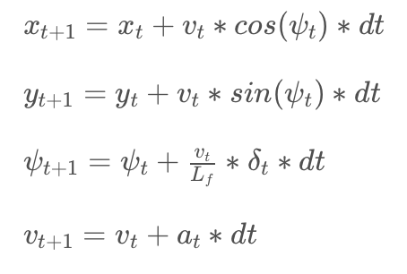
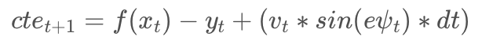
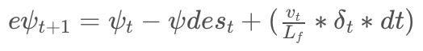
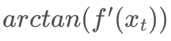
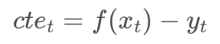
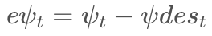

# Model Predictive Control Project

The goals / steps of this project are the following:

* Complete the MPC algorithm in C++.
* Ensure that the project compiles.
* Test the MPC with the simulator.

## [Rubric](https://review.udacity.com/#!/rubrics/896/view) Points
### Here I will consider the rubric points individually and describe how I addressed each point in my implementation.

---
### Compilation
#### 1. Your code should compile.

The code compiles without errors with cmake-3.8.2 and make-3.81 on macOS-10.12.5.

---
### Implementation
#### 1. The Model.

The Kinematic Model of the vehicle is described by the equations: <p align="center"></p>
The state variables and actuators are:

* `x`, `y`: vehicle coordinates;
* `v`: speed;
* `psi`: yaw;
* `Lf`: distance between the front of the vehicle and its center of gravity (measured 2.67m for the simulator);
* `delta`: steering angle;
* `a`: acceleration.

For optimization purpose, the vehicle state also includes the Cross Track Error (CTE) and error of psi:

* , where f(x) is the reference path polynomial evaluated at the vehicle coordinate x;
* , where  is equal to .

The initial state of the vehicle at any moment is:

* `x=0`, `y=0`, `psi=0` (assuming that the reference waypoints are converted to the vehicle coordinate system)
* v is taken from the vehicle telemetry
* <p align="left"></p>
* <p align="left"></p>

#### 2. Timestep Length and Elapsed Duration (N & dt).

The value of `dt` is chosen as 150ms to be a devisor of the observed total actuation latency (about 300ms), and to be small enough for smooth and reasonably frequent actuations. I also tried `dt` values between 50ms and 300ms, but smaller ones would challenge the optimizer performance without any visible driving improvements, the larger ones would affect the controller accuracy.

`N` is chosen after `dt` in order to predict a reasonable path. The value of 12 seems to be quite optimal: two nearest actuations are not predicted due to the latency of 2x150=300ms, while 10 remaining waypoints covering 1.5s of future path are enough for predicting road conditions at speed up to 100mph. A shorter predicted path would affect the accuracy, while a longer one would affect the controller performance without any driving improvements.

#### 3. Polynomial Fitting and MPC Preprocessing.

A 3rd order polynomial is chosen to fit the reference waypoints as well as the predicted path. Even though a 2nd order polynomial would be quite enough to model the reference path, a higher order polynomial is very useful for predicting the future way points, especially when recovering after a sharp turn at high speed, or avoiding a collision. See the polynomial fitting in methods `ModelPredictiveController::Update` and `MpcEvaluator::operator()`.

The only preprocessing made before MPC is conversion of the speed reported by the vehicle telemetry from [mph] to [m/s], because the reference waypoints are reported in the metric coordinate system. See the conversion done in method `ModelPredictiveController::Update`.

#### 4. Model Predictive Control with Latency.

As mentioned above, the observed latency is about 300ms. It's including the artificially added constant latency of 100ms, plus simulated steering inertia, plus latency of the simulator control through WebSockets. The total latency is handled by making the optimizer to use fixed actuator values set to the current state during first 300ms (2 timestamps of 150ms each). See method `MpcSolver::operator()` for more details.

---
### Simulation
#### 1. The vehicle must successfully drive a lap around the track.

A recording of the final MPC (click to see the full footage):

[](https://youtu.be/5qN5tu3Y8oY "MPC")

---

## Dependencies

* cmake >= 3.5
 * All OSes: [click here for installation instructions](https://cmake.org/install/)
* make >= 4.1
  * Linux: make is installed by default on most Linux distros
  * Mac: [install Xcode command line tools to get make](https://developer.apple.com/xcode/features/)
  * Windows: [Click here for installation instructions](http://gnuwin32.sourceforge.net/packages/make.htm)
* gcc/g++ >= 5.4
  * Linux: gcc / g++ is installed by default on most Linux distros
  * Mac: same deal as make - [install Xcode command line tools]((https://developer.apple.com/xcode/features/)
  * Windows: recommend using [MinGW](http://www.mingw.org/)
* [uWebSockets](https://github.com/uWebSockets/uWebSockets)
  * Run either `install-mac.sh` or `install-ubuntu.sh`.
  * If you install from source, checkout to commit `e94b6e1`, i.e.
    ```
    git clone https://github.com/uWebSockets/uWebSockets 
    cd uWebSockets
    git checkout e94b6e1
    ```
    Some function signatures have changed in v0.14.x. See [this PR](https://github.com/udacity/CarND-MPC-Project/pull/3) for more details.
* Fortran Compiler
  * Mac: `brew install gcc` (might not be required)
  * Linux: `sudo apt-get install gfortran`. Additionally you have also have to install gcc and g++, `sudo apt-get install gcc g++`. Look in [this Dockerfile](https://github.com/udacity/CarND-MPC-Quizzes/blob/master/Dockerfile) for more info.
* [Ipopt](https://projects.coin-or.org/Ipopt)
  * Mac: `brew install ipopt`
  * Linux
    * You will need a version of Ipopt 3.12.1 or higher. The version available through `apt-get` is 3.11.x. If you can get that version to work great but if not there's a script `install_ipopt.sh` that will install Ipopt. You just need to download the source from the Ipopt [releases page](https://www.coin-or.org/download/source/Ipopt/) or the [Github releases](https://github.com/coin-or/Ipopt/releases) page.
    * Then call `install_ipopt.sh` with the source directory as the first argument, ex: `bash install_ipopt.sh Ipopt-3.12.1`. 
  * Windows: TODO. If you can use the Linux subsystem and follow the Linux instructions.
* [CppAD](https://www.coin-or.org/CppAD/)
  * Mac: `brew install cppad`
  * Linux `sudo apt-get install cppad` or equivalent.
  * Windows: TODO. If you can use the Linux subsystem and follow the Linux instructions.
* [Eigen](http://eigen.tuxfamily.org/index.php?title=Main_Page). This is already part of the repo so you shouldn't have to worry about it.
* Simulator. You can download these from the [releases tab](https://github.com/udacity/self-driving-car-sim/releases).
* Not a dependency but read the [DATA.md](./DATA.md) for a description of the data sent back from the simulator.


## Basic Build Instructions


1. Clone this repo.
2. Make a build directory: `mkdir build && cd build`
3. Compile: `cmake .. && make`
4. Run it: `./mpc`.

## Basic Usage Instructions

The executable binary supports command-line parameters:
```
Usage instructions: ./mpc [Lf dt N S V]
  Lf  Distance between the front of the vehicle and its center of gravity (2.67 by default)
  dt  Time difference between predicted waypoints (0.15 by default)
  N   Number of predicted waypoints (12 by default)
  S   Number of nearest waypoints to skip on control due to the latency (2 by default)
  V   Desired speed in [mph] (80 by default)
```

The code is covered with some unit tests. The [Google Test](https://github.com/google/googletest) framework is used for that. To build and run the tests, enter the command in the build directory:
```
$ cmake -Dtest=ON .. && make && make test
-- Configuring done
-- Generating done
-- Build files have been written to: /Users/vernor/Documents/carnd/carnd_mpc_project/build
[  9%] Built target mpc_solver_lib
[ 47%] Built target gtest
[ 57%] Built target mpc_evaluator_lib
[ 66%] Built target test_mpc_solver
[ 76%] Built target test_mpc_evaluator
[100%] Built target mpc
Running tests...
Test project /Users/vernor/Documents/carnd/carnd_mpc_project/build
    Start 1: test_mpc_evaluator
1/2 Test #1: test_mpc_evaluator ...............   Passed    0.00 sec
    Start 2: test_mpc_solver
2/2 Test #2: test_mpc_solver ..................   Passed    1.33 sec

100% tests passed, 0 tests failed out of 2

Total Test time (real) =   1.34 sec
```
